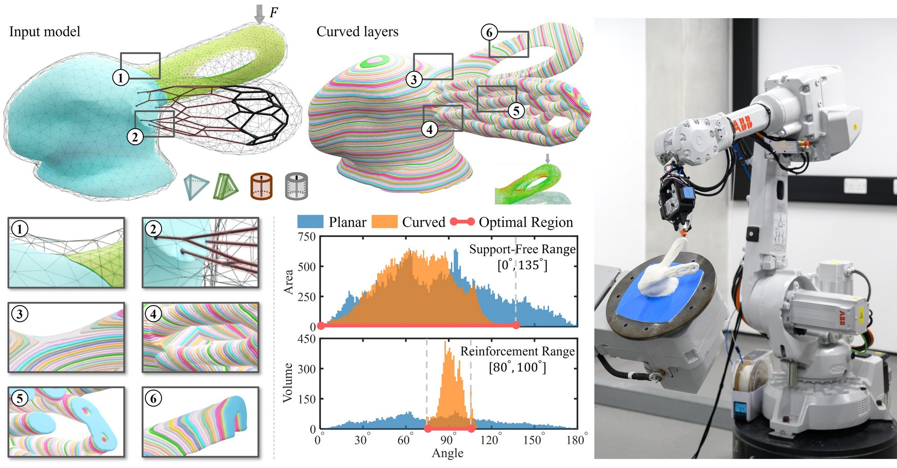
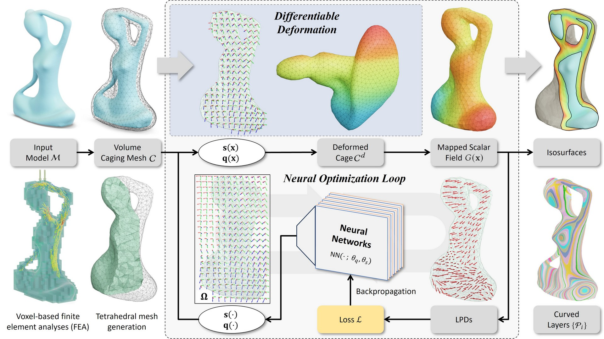
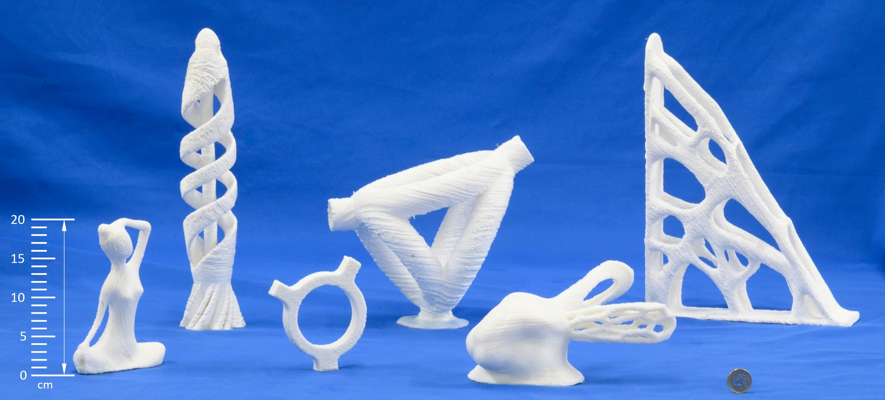

# [Code Will Release in July]
# [Neural Slicer for Multi-Axis 3D Printing](https://RyanTaoLiu.github.io/NeuralSlicer)



[Tao Liu](), [Tianyu Zhang](https://www.linkedin.com/in/tianyu-zhang-49b8231b5/), Yongxue Chen, Yuming Huang, and [Charlie C.L. Wang](https://mewangcl.github.io/), [*ACM Transactions on Graphics (SIGGRAPH 2024)*, vol.41, no.6, article no.277 (15 pages), July 2024](https://doi.org/10.1145/3658212)

## Abstract
We introduce a novel neural network-based computational pipeline as a representation-agnostic slicer for multi-axis 3D printing. This advanced slicer can work on models with diverse representations and intricate topology. The approach involves employing neural networks to establish a deformation mapping, defining a scalar field in the space surrounding an input model. Isosurfaces are subsequently extracted from this field to generate curved layers for 3D printing. Creating a differentiable pipeline enables us to optimize the mapping through loss functions directly defined on the field gradients as the local printing directions. New loss functions have been introduced to meet the manufacturing objectives of support-free and strength reinforcement. Our new computation pipeline relies less on the initial values of the field and can generate slicing results with significantly improved performance. [Video Link](https://www.youtube.com/watch?v=qNm1ierKuUk)

## Installation

Please compile the S3_Slicer code with QMake in the following link before this setup.

**Platform**: Ubuntu 20.02 + Python 3.8

We suggest using Anaconda as the virtual environment.

**Install Steps**: 

**Setp 0: Compile the [S^3-Slicer](https://github.com/zhangty019/S3_DeformFDM) code with QMake for the printing field to slicers.**

1. Add a pushbutton in the file '/S3_DeformFDM/ShapeLab/MainWindow.ui'
2. Create a correspondence slot function on_pushButtonXXX_Clicked(), and copy the realization from file '/thirdparty/additional/S3Slicer.cpp'.

**Step 1: Create and config the Python environment.**

```
!git clone https://github.com/zhangty019/S3_DeformFDM
!cd meshDeformation4MAAM
!conda env create -f environment.yml
!conda activate pytorch3d 
```



## Usage
For the example of spiral fish, we first optimize the printing direction field via Neural Slicer, as
**Step 0: Cage-based Field Generation**
```
!python ./main.py --exp_name spiral_fish --mesh earring_wc_wb.tet --cage None --stress None --wSF 1 --wSR 0 --wSQ 0 --wOP 0 --wRigid 100 --wConstraints 5 --wScaling 10 --wQuaternion 10 --nstep 5000 --wQuaternion 0.01 --lock_bottom --beta 2
```
**Step 1: Cage-based layers Generation**
Then achieve the cage-based slicers by S^3-Slicer.
And remesh via meshlab, more details in the project [S^3-Slicer](https://github.com/zhangty019/S3_DeformFDM)

**Step 2: Model-based layers Generation**
Run the following code to get the final layers.
```
!python ./utils/slicer_cut_by_implicitFunction.py --mesh earring_wc_wb.tet --output ./data/output_layers
```




## Contact Information
Tao Liu      (tao.liu@manchester.ac.uk)

Tianyu Zhang (tianyu.zhang-10@postgrad.manchester.ac.uk)

Charlie C.L. Wang  (changling.wang@manchester.ac.uk)
